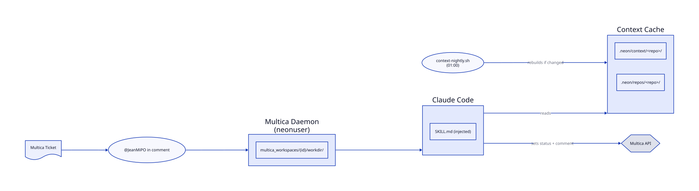

# neon-agents

Platform hosting Claude Code agents managed by [Multica](https://multica.ai) (self-hosted).

Full documentation: [flefevre.fr/blog/neon-agents](https://flefevre.fr/blog/neon-agents) *(coming soon)*

---

## Tech stack

- **[Multica](https://multica.ai)** — self-hosted agent orchestration + Kanban (Docker Compose)
- **[Claude Code](https://claude.ai/code)** — agent runtime (spawned by Multica daemon)
- **Proxmox** — homelab hypervisor (node `gallium`, LXC `neon`)
- **[repomix](https://github.com/yamadashy/repomix)** — context extraction for each repo

---

## Architecture



---

## Agents

| Name | Nickname | Role | Trigger |
|---|---|---|---|
| JeanMichelPO | JeanMiPO | Product Owner — refines tickets | `@JeanMiPO` in a Multica comment |

---

## Main commands

```bash
# Create a ticket and trigger JeanMiPO
multica issue create --project bismuth-blog --title "My feature"
# Then add a comment mentioning @JeanMichelPO in the Multica UI

# Re-trigger on an existing ticket
# Add a new comment with @JeanMichelPO in the Multica UI

# Rerun a failed/stuck task (fresh session)
multica issue rerun <issue-id>

# View execution history for a ticket
multica issue runs <issue-id>

# Daemon status
multica daemon status
systemctl status multica-daemon

# Daemon logs
multica daemon logs

# Force rebuild all context files
sudo -u neonuser bash /opt/neon-agents/scheduler/context-nightly.sh --force

# Update a skill after pushing SKILL.md changes
git -C /opt/neon-agents pull
multica skill update <skill-id>

# Check auth
multica auth status

# Multica UI
http://<neon-ip>:3000
```

---

## Adding an agent

1. Copy `agents/.template/SKILL.md` → `agents/<name>/SKILL.md`
2. Customize identity, process, and rules sections
3. Commit and push to this repo
4. In Multica: Agents → Skills → Import from GitHub
5. Create the agent, select Claude Code runtime, attach the skill
6. If the agent needs a new project: see "Adding a project" below

## Adding a project

1. Add the repo to `agents/context-builder/config.yml`
2. Update `INCLUDE_GLOBS` in `scheduler/context-nightly.sh` if needed
3. Update the workspace mapping section in **all** `agents/*/SKILL.md` files
4. Commit + push, then on the LXC:
   ```bash
   git -C /opt/neon-agents pull
   multica skill update <skill-id>   # repeat for each deployed skill
   ```
5. Add the repo clone on the LXC and register the deploy key on GitHub

---

## License

[CC BY-NC 4.0](LICENSE)
