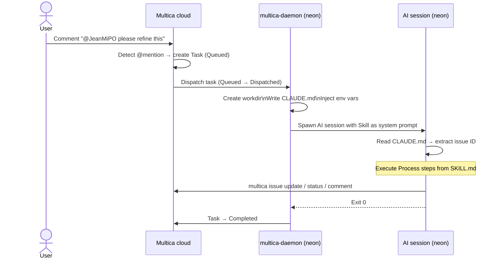
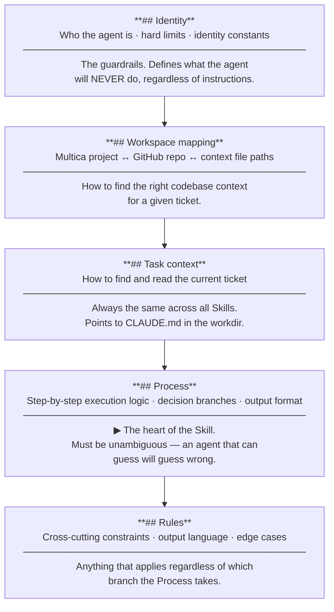

# Agents

> *Explanation — how agents work in this platform.*
>
> To create a new agent, see [skill-authoring.md](skill-authoring.md).  
> For individual agent specifications, see the files below.

---

## How an agent is triggered

The **only** way to trigger an agent is a `@mention` in a Multica comment. No automation runs on
a schedule, no polling, no webhook on PR creation. Everything is explicit and traceable.



### Key behaviours

- Mentioning an agent **does not change the issue status**. Status changes only when the agent
  explicitly calls `multica issue status <id> <new-status>`.
- If an agent is mentioned and already has a queued task on the same issue from the same comment,
  the duplicate is ignored. Use a **new comment** or `multica issue rerun` to re-trigger.
- Agents cannot trigger themselves (self-reference protection in Multica).
- The trigger works regardless of the current issue status (`backlog`, `blocked`, `todo`…). An
  agent mentioned on a `blocked` ticket will run — it is up to the Skill to handle the situation.

---

## What happens at execution time

### The workdir

Every task gets a fresh, isolated directory:

```
/home/neonuser/multica_workspaces/{workspace_id}/{task_id}/workdir/
```

This directory is:
- Created just before the AI session starts
- The working directory for the entire session
- Ephemeral — not reused across tasks

Agents that write files during a session (e.g., drafts, intermediate results) write them here.
Those files are not accessible in future sessions.

### The injected `CLAUDE.md`

Multica writes a `CLAUDE.md` file in the workdir before spawning the session. This file contains:

- The issue ID, title, description
- All comments in chronological order
- The agent's identity constants (from the Skill configuration)
- The workspace mapping (Multica project → GitHub repo)
- A catalog of available `multica` CLI commands

This is the agent's primary source of truth. **Every Skill must read `CLAUDE.md` first.**

> The file is named `CLAUDE.md` because the current AI runtime is Claude Code, which reads and
> interprets this filename specially. It is the one feature in the platform that is
> Claude Code-specific — other runtimes would use a different injection mechanism.

### Environment variables

| Variable | Content |
|---|---|
| `MULTICA_TOKEN` | Auth token — used automatically by the `multica` CLI |
| `MULTICA_SERVER_URL` | API base URL |
| `MULTICA_WORKSPACE_ID` | Workspace UUID (Mendeleiv Lab) |
| `MULTICA_AGENT_NAME` | Agent name as configured in Multica |
| `MULTICA_AGENT_ID` | Agent UUID |
| `MULTICA_TASK_ID` | **Task** ID — not the issue ID |

> `MULTICA_TASK_ID` is frequently confused with the issue ID. They are different. The issue ID
> (e.g., `NA-42`) is in `CLAUDE.md`. The task ID is the execution record created by Multica for
> this specific session.

---

## Anatomy of a `SKILL.md`

A Skill is a plain Markdown file with five standard sections. Each section serves a distinct
purpose and is read differently by the agent.



### `## Identity`

Defines who the agent is, what its role is, and what it must never do.

- **Role description**: one paragraph on the agent's purpose and tone
- **Hard limits**: explicit list of actions the agent must never take (e.g., no git writes for JeanMichelPO)
- **Identity constants**: values set at deployment time (e.g., `HUMAN_USERNAME: Trophalaxeur`)

Hard limits are the most important part of this section. They are the guardrails that prevent an
agent from causing unintended side effects. Write them as absolute prohibitions, not guidelines.

### `## Workspace — project to repo mapping`

A lookup table the agent uses to find the right context cache and repo clone for a given Multica
project. Example:

```
- Multica project `bismuth-blog` → GitHub repo `Trophalaxeur/bismuth-blog`

Context cache: /home/neonuser/.neon/context/<repo-name>/context.md
Repos:         /home/neonuser/.neon/repos/Trophalaxeur/<repo-name>/
```

This section must be updated whenever a new repository is added to the platform.

### `## Task context`

Tells the agent how to read its task. Always the same across all Skills:

```markdown
Your task is injected by Multica in the `CLAUDE.md` at your workdir root.
Read it first — it contains the issue ID, title, description, and comments.
```

Also clarifies the `MULTICA_TASK_ID` vs issue ID distinction.

### `## Process`

The agent's step-by-step execution logic. This is the heart of the Skill. It defines:

- What the agent reads and in what order
- The decision branches it may take
- The exact CLI commands it should run
- The output format for each decision path

The process must be **unambiguous**: an agent that can guess will guess wrong. Every step should
have a clear input, a clear output, and clear conditions for moving to the next step.

### `## Rules`

Terminal constraints applied on top of the process. Typically:

- Language of output (always English for all agents in this platform)
- Format of comments and descriptions
- Things not covered in the process that the agent must always or never do

---

## Deployed agents

| Agent | Skill file | Trigger handle | Type | Specification |
|---|---|---|---|---|
| JeanMichelPO | `agents/product-owner/SKILL.md` | `@JeanMiPO` | Reference | [jean-michel-po.md](jean-michel-po.md) |
