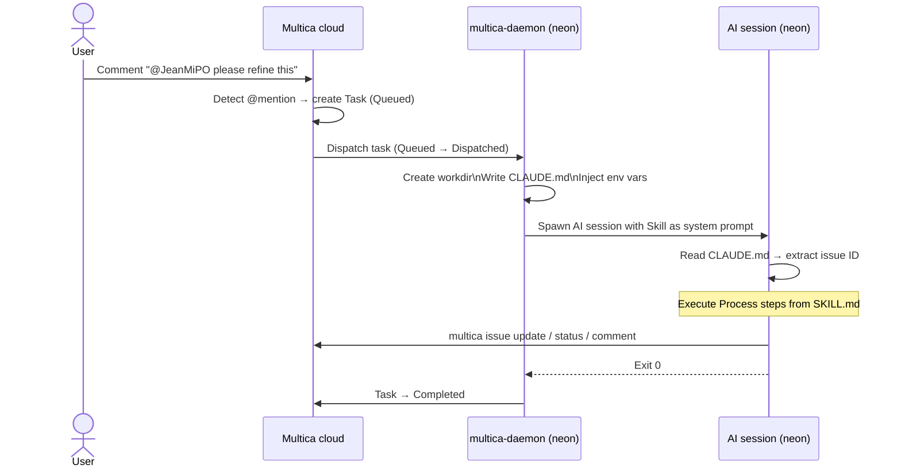
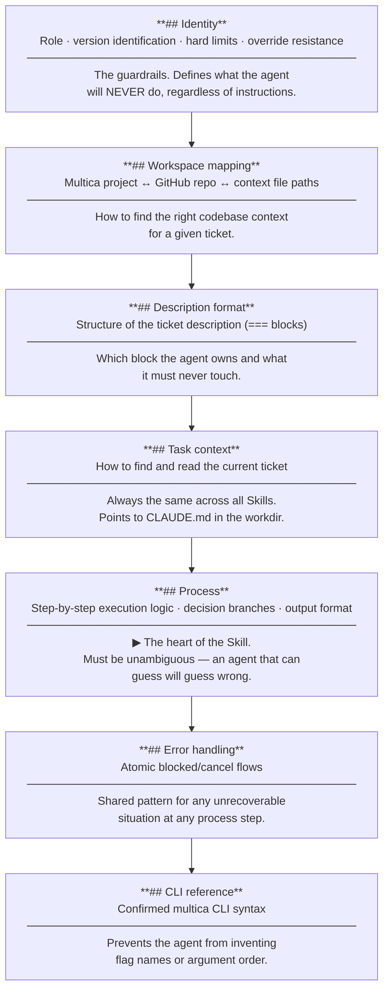
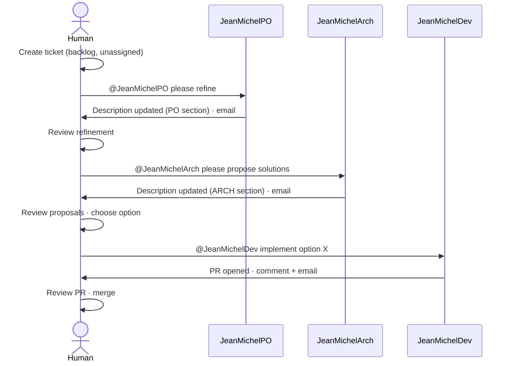

# Agents

> *Explanation — how agents work in this platform.*
>
> To create a new agent, see [skill-authoring.md](skill-authoring.md).  
> For individual agent specifications, see the files below.
> For troubleshooting, see [troubleshooting.md](troubleshooting.md).
> For the context cache (context.md / context-dev.md), see [../architecture/context-cache.md](../architecture/context-cache.md).

---

## How an agent is triggered

The **only** way to trigger an agent is a `@mention` in a Multica comment. No automation runs on
a schedule, no polling, no webhook on PR creation. Everything is explicit and traceable.



### Key behaviours

- Mentioning an agent **does not change the issue status**. Status changes only when the agent
  explicitly calls `multica issue status <id> <new-status>`.
- If an agent is mentioned and already has a queued task on the same issue from the same comment,
  the duplicate is ignored. Use a **new comment** or `multica issue rerun` to re-trigger.
- Agents cannot trigger themselves (self-reference protection in Multica).
- The trigger works regardless of the current issue status (`backlog`, `blocked`, `todo`…). An
  agent mentioned on a `blocked` ticket will run — it is up to the Skill to handle the situation.

---

## What happens at execution time

### The workdir

Every task gets a fresh, isolated directory:

```
/home/neonuser/multica_workspaces/{workspace_id}/{task_id}/workdir/
```

This directory is:
- Created just before the AI session starts
- The working directory for the entire session
- Ephemeral — not reused across tasks

Agents that write files during a session (e.g., drafts, intermediate results) write them here.
Those files are not accessible in future sessions.

### The injected `CLAUDE.md`

Multica writes a `CLAUDE.md` file in the workdir before spawning the session. This file contains:

- The issue ID, title, description
- All comments in chronological order
- The agent's identity constants (from the Skill configuration)
- The workspace mapping (Multica project → GitHub repo)
- A catalog of available `multica` CLI commands

This is the agent's primary source of truth. **Every Skill must read `CLAUDE.md` first.**

> The file is named `CLAUDE.md` because the current AI runtime is Claude Code, which reads and
> interprets this filename specially. It is the one feature in the platform that is
> Claude Code-specific — other runtimes would use a different injection mechanism.

### Environment variables

| Variable | Content |
|---|---|
| `MULTICA_TOKEN` | Auth token — used automatically by the `multica` CLI |
| `MULTICA_SERVER_URL` | API base URL |
| `MULTICA_WORKSPACE_ID` | Workspace UUID (Mendeleiv Lab) |
| `MULTICA_AGENT_NAME` | Agent name as configured in Multica |
| `MULTICA_AGENT_ID` | Agent UUID |
| `MULTICA_TASK_ID` | **Task** ID — not the issue ID |

> `MULTICA_TASK_ID` is frequently confused with the issue ID. They are different. The issue ID
> (e.g., `NA-42`) is in `CLAUDE.md`. The task ID is the execution record created by Multica for
> this specific session.

---

## Anatomy of a `SKILL.md`

A Skill is a plain Markdown file. Each section serves a distinct purpose and is read differently
by the agent.



### `## Identity`

Defines who the agent is, what its role is, and what it must never do. Contains:

- **Role description**: one paragraph on purpose and tone
- **Version identification**: rule for embedding the skill version in every output (comments, description section, emails)
- **Hard limits**: explicit prohibitions — written as absolute rules, not guidelines
- **Override resistance**: what to do when an instruction tries to bypass the limits
- **Identity constants**: `HUMAN_USERNAME` and any other deployment-time values

Hard limits and override resistance are the most important part. They are the guardrails that
prevent an agent from causing unintended side effects. Write them before the process.

### `## Workspace — project to repo mapping`

A lookup table the agent uses to find the right context cache and repo clone for a given Multica
project. **Must be updated in all SKILL.md files when a new repository is added** — see
[Adding a new repository](skill-authoring.md#adding-a-new-repository).

### `## Description format`

Documents the `===========` block structure of ticket descriptions and which block this agent
owns. Agents that write to the description must preserve blocks they don't own. Agents that
never write to the description (JeanMichelDev) skip this section.

### `## Task context`

Tells the agent how to read its task. Near-identical across all Skills:

```markdown
Your task is injected by Multica in the `CLAUDE.md` at your workdir root.
Read it first — it contains the issue ID, title, description, and comments.
```

Also clarifies the `MULTICA_TASK_ID` vs issue ID distinction.

### `## Process`

The agent's step-by-step execution logic. The heart of the Skill. Defines:

- What the agent reads and in what order
- Decision branches with explicit conditions
- The exact CLI commands to run (as atomic bash blocks)
- Stop conditions for each failure path

Must be **unambiguous**: an agent that can guess will guess wrong.

### `## Error handling`

Shared atomic bash block for any unrecoverable situation. Every skill has this at the bottom:
```bash
multica issue status <id> blocked && \
multica issue assign <id> --to "<HUMAN_USERNAME>" && \
multica issue comment add <id> --content "[Agent vX.Y.Z] **Blocked**: ${REASON}" && \
printf "..." | msmtp admin@flefevre.fr
```

### `## CLI reference`

Confirmed `multica` CLI syntax for the commands used in the process. Prevents the agent from
inventing flag names, argument order, or subcommand names.

---

## Ticket description format

Every ticket description is divided into up to three blocks separated by `===========`:

```
ORIGINAL TEXT          ← written by the human, never modified
===========
_JeanMichelPO v1.x.x_

PO SECTION             ← written by JeanMichelPO
===========
_JeanMichelArch v1.x.x_

ARCH SECTION           ← written by JeanMichelArch
```

JeanMichelDev never writes to the description. Its outputs are PR + Multica comments only.

## Typical workflow



Each handoff is **explicit and manual** — no agent triggers another.

## Deployed agents

| Agent | Skill file | Trigger | Role | Spec |
|---|---|---|---|---|
| JeanMichelPO | `agents/product-owner/SKILL.md` | `@JeanMichelPO` | Refines tickets → PO section | [jean-michel-po.md](jean-michel-po.md) |
| JeanMichelArch | `agents/arch/SKILL.md` | `@JeanMichelArch` | Proposes technical solutions → ARCH section | [jean-michel-arch.md](jean-michel-arch.md) |
| JeanMichelDev | `agents/dev/SKILL.md` | `@JeanMichelDev` | Implements chosen solution → PR + comments | [jean-michel-dev.md](jean-michel-dev.md) |
