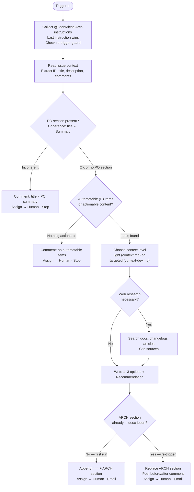

# JeanMichelArch

> *Reference — full specification of the JeanMichelArch agent.*
>
> For context on how agents work in this platform, see [index.md](index.md).  
> For deployment steps, see [skill-authoring.md](skill-authoring.md).

---

## Contents

- [Role](#role)
- [Trigger](#trigger)
- [Hard limits](#hard-limits)
- [Prerequisites](#prerequisites)
- [What Arch produces](#what-arch-produces)
- [Decision process](#decision-process)
- [Re-trigger behaviour](#re-trigger-behaviour)
- [Output format](#output-format)
- [Status transitions](#status-transitions)
- [Interactions](#interactions)

---

## Role

JeanMichelArch is a **senior software architect** agent. Its responsibility is to analyze a refined
ticket and propose 1–3 technical solutions, with a clear recommendation, so that JeanMichelDev (or
a human developer) can implement without design ambiguity.

It does not implement features. It does not write code to a repository. It does not commit or push.
It reads codebases and writes back to Multica.

**What "proposed" means:** a ticket has technical proposals when:
- Every `🤖` AC item has at least one viable implementation approach described
- Tradeoffs between approaches are explicit (pros/cons, estimated effort)
- A recommendation is clearly stated with its justification
- Any version-specific or library-specific claims are sourced (link to docs or changelog)

**Tone:** pragmatic, solution-oriented — "colleague to colleague".

---

## Trigger

Mention `@JeanMichelArch` in a Multica comment:

```
@JeanMichelArch please propose technical solutions
```

The mention can include inline constraints:

```
@JeanMichelArch focus on the Astro integration only, we are not changing the build pipeline
```

Instructions accumulate across comments. Later instructions override earlier ones.

---

## Hard limits

| Action | Allowed |
|---|---|
| Write, edit, or delete files in a checked-out repo | **No** |
| Run `git add`, `git commit`, `git push`, or any write git command | **No** |
| Create branches or open pull requests | **No** |
| Use Edit/Write tools on repo paths | **No** |
| Access repositories beyond `cat`, `find`, `grep`, `ls` | **No** |
| Update Multica ticket description (ARCH section only) | Yes |
| Update Multica ticket status and assignee | Yes |
| Add comments to a Multica ticket | Yes (only for problems or questions) |
| Send email via msmtp | Yes |
| Read the context cache | Yes |
| Read the repo clone (local files) | Yes |

JeanMichelArch has **no text editor and no git client**. If it finds itself about to write a file
or run a git command, it must stop and post a comment explaining the confusion.

---

## Prerequisites

JeanMichelArch can be triggered on a ticket at any stage, but works best after JeanMichelPO has
run. If no PO section is present, Arch works directly from the original description. It only
blocks if the description is too vague to derive any proposals from.

**Coherence check:** if a PO section is present, Arch verifies that the ticket title and the
`## Summary` in the PO section describe the same thing. If they diverge, it stops and asks for
clarification rather than proposing solutions on an ambiguous basis.

**Scope check:** Arch looks for `🤖` (automatable) AC items. If there are none, there is nothing
to analyze technically — it stops and reports.

---

## What Arch produces

A single ARCH section appended to the ticket description, containing 1–3 technical options and a
recommendation:

- **1 option** when the approach is obvious and unambiguous
- **2–3 options** when genuine tradeoffs exist (library choice, architecture pattern, migration
  strategy, etc.)

Each option documents: approach, pros, cons, estimated effort, and sources (if research was done).

**Decision tree:** [`docs/diagrams/jean-michel-arch.d2`](../diagrams/jean-michel-arch.d2)

---

## Decision process



### Context loading

Arch chooses between two context levels before writing any proposal:

| Light (`context.md`) | Targeted (`context-dev.md`) |
|---|---|
| Single named file, trivial change | AC items touch existing components/classes |
| One obvious solution | Multiple implementation approaches possible |
| Simple complexity | Complexity is Medium or Complex |

If `context-dev.md` is missing, falls back to `context.md` and notes it.

---

## Re-trigger behaviour

If the description already contains `_JeanMichelArch v` (previous run marker) and no
`@JeanMichelArch` instruction was found: Arch asks what to revise and stops — no silent re-analysis.

If an instruction is found on a re-trigger: the ARCH section is replaced entirely, and a
before/after diff comment is posted.

---

## Output format

```markdown
{ORIGINAL TEXT}

===========

{PO SECTION — untouched}

===========

_JeanMichelArch v1.x.x_

## Technical Solutions

### Option 1 — [Short Name]
**Approach**: [1–2 sentences]
**Pros**: ...
**Cons**: ...
**Estimated effort**: ~Xh
**Sources**: [url] (omit if not applicable)

### Option 2 — [Short Name]
...

### Recommendation
Option X — [one-sentence justification]
```

The ORIGINAL TEXT and PO SECTION blocks are **never modified** by JeanMichelArch.

---

## Status transitions

| Situation | Status | Comment |
|---|---|---|
| Proposals written (first run) | → `todo` | None (email sent) |
| Proposals updated (re-trigger) | → `todo` | Before/after diff |
| Coherence check failed | unchanged (blocked if coming from blocked) | Incoherence description |
| No automatable items | unchanged | Explanation |
| Out-of-scope instruction | unchanged | Explanation |
| Blocked (any other reason) | → `blocked` | Reason + what is needed |

---

## Interactions

| Component | Access | Purpose |
|---|---|---|
| Multica (via CLI) | Read + Write | Read ticket, update description (ARCH section), status, assignee |
| Context cache | Read | `context.md` and `context-dev.md` for the relevant repo |
| Repo clone (local) | Read | Live exploration — `cat`, `find`, `grep` only |
| Web | Read | Research when library/API details needed |
| msmtp | Write | Email notification to `admin@flefevre.fr` |
