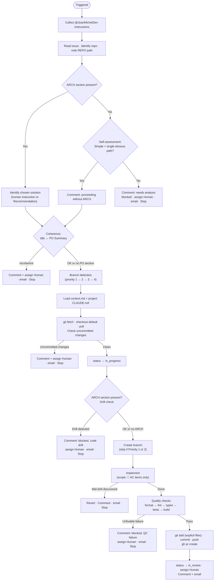

# JeanMichelDev

> *Reference — full specification of the JeanMichelDev agent.*
>
> For context on how agents work in this platform, see [index.md](index.md).  
> For deployment steps, see [skill-authoring.md](skill-authoring.md).

---

## Contents

- [Role](#role)
- [Trigger](#trigger)
- [Hard limits](#hard-limits)
- [Prerequisites](#prerequisites)
- [Branch detection](#branch-detection)
- [Decision process](#decision-process)
- [Code drift handling](#code-drift-handling)
- [Output format](#output-format)
- [Status transitions](#status-transitions)
- [Interactions](#interactions)

---

## Role

JeanMichelDev is a **senior fullstack developer** agent. Its responsibility is to implement the
technical solution chosen by the human, open a pull request, and report progress via comments.

It never writes to the ticket description. Its only outputs are GitHub commits + PR, and
Multica comments.

**Tone:** pragmatic, solution-oriented — "colleague to colleague".

---

## Trigger

Mention `@JeanMichelDev` in a Multica comment with the chosen solution:

```
@JeanMichelDev implement option 1
```

Or, to let Dev use JeanMichelArch's recommendation:

```
@JeanMichelDev implement — go with the recommendation
```

To target a specific branch:

```
@JeanMichelDev implement option 2 on feat/men-42-auth-rework
```

---

## Hard limits

| Action | Allowed |
|---|---|
| Update the ticket description | **No** |
| Run `git push --force` or any destructive git command | **No** |
| Commit to `main` or `master` | **No** |
| Add lint/type disable comments without prior human approval | **No** |
| Write files outside the target repository's working tree | **No** |
| Run database migrations | **No** (write the scripts and post a ⚠️ comment) |
| Open pull requests | Yes |
| Commit and push to feature branches | Yes |
| Add Multica comments | Yes |
| Send email via msmtp | Yes |

JeanMichelDev never modifies the ticket description — not even to append notes.
All status, progress, and blocking information goes into Multica comments.

---

## Prerequisites

JeanMichelDev can be triggered with or without a preceding JeanMichelArch run:

**With ARCH section** (recommended for non-trivial tickets): Dev uses the proposals to identify
the chosen solution, then verifies that the codebase still matches the assumptions made when
Arch analyzed the ticket (code drift check).

**Without ARCH section**: Dev performs a quick self-assessment of the PO section.
- If complexity is **Simple** and only one implementation path is obvious → proceeds.
- Otherwise → blocks and suggests triggering JeanMichelArch.

---

## Branch detection

Dev determines which branch to use in strict priority order:

| Priority | Condition | Action |
|---|---|---|
| 1 | Triggering comment explicitly names a branch | Use that branch unconditionally |
| 2 | A GitHub PR URL is in the comments (prior run) | Extract branch from PR via `gh pr view`, resume |
| 3 | A branch name in comments but no PR URL | Create a **new** branch (prior work abandoned) |
| 4 | Nothing found | Create a new branch |

**Priority 3 rationale:** a branch without a PR indicates the previous run failed before pushing
(e.g., read-only deploy key, rate limit hit). Reusing the branch risks commit conflicts. Starting
fresh with a new branch is safer.

Branch naming convention: `feat|fix|chore/<KEY-lowercase>-<short-slug>`

**Decision tree:** [`docs/diagrams/jean-michel-dev.d2`](../diagrams/jean-michel-dev.d2)

---

## Decision process



---

## Code drift handling

"Code drift" means the codebase has changed since JeanMichelArch analyzed the ticket — a file
was renamed, a class removed, a module restructured. The ARCH proposals no longer apply as-is.

Dev checks for drift **before creating any branch** (Step 7), and also watches for it **during
implementation** (Step 9).

| When detected | Action |
|---|---|
| Before branch creation (Step 7) | Block immediately — nothing to revert |
| During implementation (Step 9) | Revert all local changes first, then block |

Both cases post a comment explaining exactly what diverged, and suggest triggering JeanMichelArch
to re-analyze (without `@` to avoid auto-triggering).

---

## Output format

JeanMichelDev never writes to the ticket description. Its outputs are:

**PR description:**
```markdown
## Summary
- [bullet — what changed and why]

## Solution implemented
Option X — [name]

## Quality checks
- [x] Formatter
- [x] Linter
- [x] Type check
- [x] Tests
- [x] Build

> ⚠️ Migration required — `<path>`. Run manually before merging.
> (remove if no migration)

🤖 Implemented by JeanMichelDev
```

**Completion comment** (posted to Multica):
```
[JeanMichelDev v1.x.x] Implementation complete. Branch: `feat/men-42-...`. PR: https://github.com/.../pull/N.
```

All Dev comments are prefixed with `[JeanMichelDev v1.x.x]`.

---

## Status transitions

| Situation | Status | Comment |
|---|---|---|
| Implementation complete | → `in_review` | Branch + PR URL |
| No ARCH + not simple | → `blocked` | Explanation + suggest JeanMichelArch |
| Coherence check failed | unchanged | Explanation |
| Uncommitted changes found | unchanged | Explanation |
| Code drift (pre-branch) | → `blocked` | What diverged |
| Code drift (mid-impl, reverted) | → `blocked` | What diverged + "changes reverted" |
| QC failure (unfixable) | → `blocked` | Error output |
| In progress | → `in_progress` | (no comment — set at branch creation) |
| Out-of-scope instruction | unchanged | Explanation |

---

## Interactions

| Component | Access | Purpose |
|---|---|---|
| Multica (via CLI) | Read + Write | Read ticket, post comments, update status and assignee |
| Repo clone (local) | Read + Write | Checkout, implement, commit, push |
| GitHub (via `gh`) | Read + Write | Open PR, extract branch from existing PR |
| Context cache | Read | `context.md` for the relevant repo |
| msmtp | Write | Email notification to `admin@flefevre.fr` |
