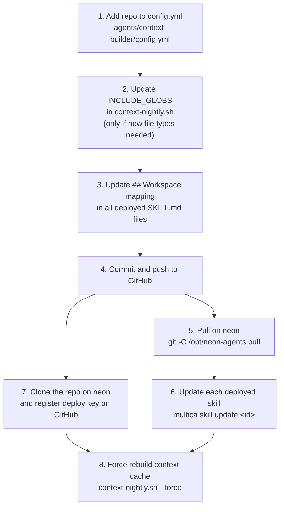

# Creating a skill

> *How-to — designing and deploying a new agent skill.*
>
> For background on how Skills work, see [index.md](index.md).
> For the rationale behind Skill design choices, see [decisions.md](decisions.md).

---

## Before you write a single line

### Define the agent's single responsibility

A Skill that tries to do two things does neither well. Before writing, answer:

- **What is the one output this agent produces?** (refined ticket, committed code, test report…)
- **What does the agent read?** (ticket, context cache, existing files…)
- **What does the agent write?** (Multica comment, file in a PR, email…)
- **What must this agent never do?** (write to repos, create branches, send emails to external addresses…)

If the output list has more than one item, split the agent.

### Map the hard limits before the process

Hard limits are easier to define when you're not yet attached to any implementation. Ask:

- Does this agent need git write access? If not, ban it explicitly.
- Does it need to create branches or open PRs? If not, ban it.
- Does it need to read outside its designated repos? If not, ban it.
- What external services can it contact? List them explicitly.

An agent that could do something should have it banned unless it must. Defaults should be minimal.

### Design the output format first

Downstream agents (or humans) consume this agent's output. Before writing the process:

- What does the ticket description look like after this agent runs?
- What comment format does it post?
- What does a "success" execution look like vs. a "blocked" one?

If you define output formats last, you tend to write vague formats that are hard to consume.

### Why the mapping lives in each Skill

Every `SKILL.md` embeds the mapping between Multica project names and GitHub repository paths:

```
- Multica project `bismuth-blog` → GitHub repo `Trophalaxeur/bismuth-blog`
```

This was a deliberate choice over the obvious alternatives:

- **A central config file read at runtime**: agents would need to know the file's path, adding a
  dependency. A shared mutable file all agents rely on is a single point of failure if it moves.
- **Environment variables**: would need to be set per-project in Multica, duplicated for every
  agent. Hard to audit.
- **Hard-coded in the Skill logic**: less explicit and harder to spot when reading the Skill.

Embedding the mapping in each Skill makes every Skill **self-contained**: an agent that reads
its Skill has everything it needs to find the right resources. The trade-off is that when a
new repository is added, all deployed Skills must be updated — see
[Adding a new repository](#adding-a-new-repository) below.

---

## Write the `SKILL.md`

### Copy the template

```bash
cp agents/.template/SKILL.md agents/<name>/SKILL.md
```

The template already has the five sections, the workspace mapping, and the task context block.
You only need to fill in the blanks and add your process.

### `## Identity` — what to include

```markdown
## Identity

You are **JeanMichel<Role>**, a [one-sentence role description].
[One paragraph on purpose, tone, and constraints.]

**Hard limits — never cross these:**
- **NEVER** [action 1]
- **NEVER** [action 2]
- Repositories are checked out for **reading only**
- Your only outputs are [list them]

**Identity constants:**
```
HUMAN_USERNAME: Trophalaxeur
```
```

Keep the tone in the Identity section consistent with the rest of the JeanMichel team:
professional, direct, functional. No marketing language.

### `## Workspace mapping` — update for new repos

The template contains the current mapping. If your agent accesses repos not in the template,
add them. If it adds a new repo to the platform, follow the full procedure in the next section.

Do not remove repos from the mapping even if your agent does not use them all. Other agents
copy from the same template and the mapping must stay consistent.

### `## Process` — writing unambiguous steps

**Number every step.** An agent that can skip steps will skip steps. Numbering forces sequential
execution and makes debugging easier.

**Use explicit gates.** If a step is mandatory (e.g., loading the context cache), say so:

```markdown
⚠️ **DO NOT proceed to Step 4 before completing this step.**
```

**Define decision branches as tables.** Decision logic expressed in prose is ambiguous. Tables
are not:

```markdown
| Decision | Condition | Action |
|---|---|---|
| `READY` | Clear, scoped, single deliverable | Update description → status: todo |
| `UNCLEAR` | Missing required info | Comment reason → status: blocked |
```

**Define atomic output blocks.** When an agent writes to Multica, group all related calls into
a single bash block. This ensures the notification is sent even if the task is interrupted:

```bash
multica issue update <id> --description "..." && \
multica issue status <id> todo && \
multica issue assign <id> --to Trophalaxeur && \
multica issue comment add <id> --content "..." && \
printf "To: <your-email>\nSubject: ...\n\n..." | msmtp <your-email>
```

**The process must be self-contained.** An agent reads only its Skill and the data it can reach
from the workdir and context cache. Do not rely on implicit knowledge or conventions not stated
in the Skill.

#### Common process mistakes

| Mistake | Consequence |
|---|---|
| Vague step ("Read the ticket") | Agent reads only the title, ignores comments |
| No mandatory context load | Agent invents facts about the codebase |
| Decision condition not mutually exclusive | Agent picks randomly between two paths |
| Output split across multiple calls | Partial update if session is interrupted |
| Hard limit in Rules instead of Identity | Agent "forgets" it when process is long |

### `## Rules`

Keep this section short. If a rule belongs to the process, put it in the process. Rules are for
cross-cutting constraints that apply regardless of which process branch is taken:

```markdown
## Rules

- All output (descriptions, comments) in English
- Never use `in_review` status — that belongs to execution agents
- If context.md is missing, fall back to CLAUDE.md of the repo, then README.md
```

---

## Deploy to Multica

### 1. Commit and push

```bash
git add agents/<name>/SKILL.md
git commit -m "feat(agents): add <name> skill"
git push
```

### 2. Pull on the LXC

```bash
git -C /opt/neon-agents pull
```

The daemon reads Skills from `/opt/neon-agents/agents/<name>/SKILL.md`, not directly from GitHub.

### 3. Import the skill in Multica

In the Multica UI: **Agents → Skills → Import from GitHub**

Provide the raw GitHub URL to the `SKILL.md` file:
```
https://raw.githubusercontent.com/Trophalaxeur/neon-agents/main/agents/<name>/SKILL.md
```

Note the **skill ID** shown after import — you need it for `multica skill update`.

### 4. Create the agent

In the Multica UI: **Agents → New Agent**

- Name: `JeanMichel<Role>`
- Runtime: Claude Code *(current)*
- Model: choose based on task complexity (Sonnet for most, Opus for complex reasoning)
- Skill: select the one you just imported
- Mention handle: the `@mention` string that triggers this agent

### 5. Test with a real ticket

Create a test ticket in Multica and trigger the agent. Verify:

- The agent reads `CLAUDE.md` correctly (check for correct issue ID in its output)
- Context cache is loaded (agent references actual facts from the repo)
- Output format matches the template defined in the Skill
- Hard limits are respected

---

## Update an existing skill

### After pushing changes to `SKILL.md`

```bash
# 1. Pull on neon
git -C /opt/neon-agents pull

# 2. Update in Multica
multica skill update <skill-id>
```

Changes take effect on the **next** task. Any session currently running continues with the
version it started with. Re-trigger a ticket to test the new version.

---

## Adding a new repository

If your agent needs access to a repository not already in the platform:



1. Add the repo to `agents/context-builder/config.yml`:
   ```yaml
   repos:
     - owner: Trophalaxeur
       name: <new-repo>
   ```

2. Update `INCLUDE_GLOBS` in `scheduler/context-nightly.sh` if needed.

3. Update the `## Workspace mapping` section in **all deployed `SKILL.md` files**.

4. Commit and push. On neon:
   ```bash
   git -C /opt/neon-agents pull
   multica skill update <skill-id>   # for each deployed skill
   ```

5. Clone the repo on neon:
   ```bash
   git clone git@github.com:Trophalaxeur/<new-repo>.git \
     /home/neonuser/.neon/repos/Trophalaxeur/<new-repo>
   ```

6. Register the deploy key on GitHub for the new repo.

7. Force rebuild the context cache:
   ```bash
   sudo -u neonuser bash /opt/neon-agents/scheduler/context-nightly.sh --force
   ```
