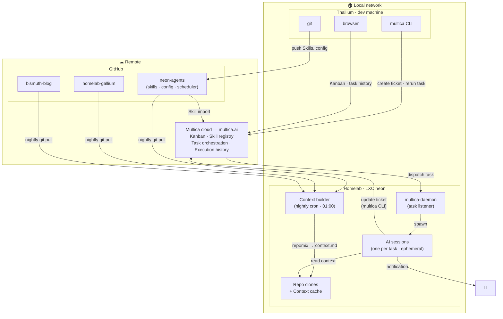
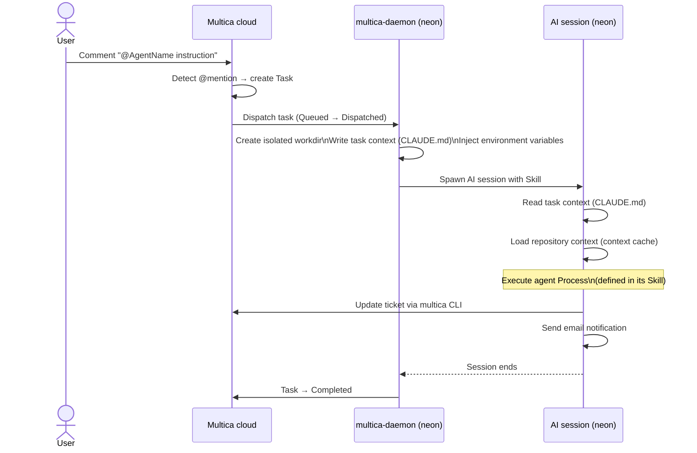

# Architecture

> *Explanation — the system as it stands today.*
>
> For the rationale behind these architectural choices, see [decisions.md](decisions.md).
> For full-size diagrams, see [diagrams/architecture.svg](diagrams/architecture.svg) (static topology) and [diagrams/workflow.svg](diagrams/workflow.svg) (execution flow).

---

## System components

The platform spans two distinct zones: remote services (internet) and the local network.

---

## Components in detail

### GitHub

The **source of truth** for all agent skills, configuration, and the nightly scheduler.
Nothing is configured locally on the LXC — everything flows from this repository.

Three repositories are currently managed by the platform:

| Repository | Role |
|---|---|
| `Trophalaxeur/neon-agents` | Platform itself: skills, config, scheduler |
| `Trophalaxeur/homelab-gallium` | Homelab infra (Terraform + Ansible) |
| `Trophalaxeur/bismuth-blog` | Personal blog |

The `neon-agents` repository is **public**. Skills contain no secrets — sensitive values are
injected by Multica via environment variables at execution time.

### Multica cloud — multica.ai

The **orchestration and Kanban layer**. Multica handles:

- The Kanban board: tickets, statuses, comments, assignees
- Skill import from GitHub (reads `SKILL.md` by URL)
- Agent configuration (model, runtime, mention handle)
- Task dispatch: when a trigger fires, Multica sends a task to the daemon on the LXC
- Task lifecycle tracking: `Queued → Dispatched → Running → Completed`
- Execution history per ticket

Multica does **not** run any AI sessions itself. It dispatches tasks to the daemon on neon,
which does the actual execution.

### LXC neon

The **compute node**. Runs as a container inside the homelab (Proxmox node `gallium`).

| Process / component | Role |
|---|---|
| `multica-daemon` | Always-on service. Receives tasks from Multica cloud, creates isolated workdirs, spawns AI sessions, reports completion. |
| AI sessions | Ephemeral processes, one per task. Spawned by the daemon. Execute the agent's Skill. |
| Context builder | Nightly cron job. Pulls each repo from GitHub, runs repomix, writes `context.md` files. |
| Repo clones | Local copies of each managed repository. Used by the context builder and readable by AI sessions. |
| Context cache | Per-repo `context.md` files generated by repomix. The only read source for AI sessions at execution time. |

Everything runs as `neonuser`. The daemon never runs as root.

### Thallium — dev machine

The **operator's workstation** (Arch Linux). Three tools are used:

| Tool | Purpose |
|---|---|
| `git` | Write and push Skills, configuration, scheduler scripts |
| `multica` CLI | Create tickets, trigger agents, monitor execution history |
| Browser | Access Multica UI (Kanban, Skill management, task logs) |

No daemon runs on Thallium — the `multica` CLI is CLI-only, authenticated via OAuth.

---

## AI runtime

### Claude Code CLI — not Anthropic API tokens

AI sessions on neon run **Claude Code**, Anthropic's CLI tool — the same binary a developer
uses interactively. The daemon spawns it in non-interactive mode with the Skill injected as
the system prompt.

This is a deliberate cost decision:

| Approach | Billing model | When it makes sense |
|---|---|---|
| **Claude Code CLI** *(current)* | Flat monthly subscription | Low-to-moderate agent volume — all sessions are covered by the plan |
| **Anthropic API** *(future option)* | Per-token billing | High volume — fine-grained cost visibility per task, but higher unit cost |

At the current scale, the total number of agent sessions fits comfortably within the Claude
subscription. If volume grows significantly — many agents, many triggered tasks per day — the
platform would migrate to direct Anthropic API calls, which would give per-task cost control
but would require managing API keys and token budgets per session.

The SKILL.md files and the platform architecture are agnostic to this choice: switching runtimes
is a Multica agent configuration change, not a code change.

---

## Who reads and writes what

| Component | Reads | Writes |
|---|---|---|
| GitHub | — | Receives git push from Thallium |
| Multica cloud | Skills from GitHub | Task dispatch to neon, ticket state |
| LXC neon | Repo clones (context builder), context cache, task context (AI sessions) | `context.md` (builder), ticket updates via CLI (sessions), email notifications |
| Thallium | Kanban, task history (browser), email | Git push, multica CLI calls |

---

## Execution sequence

Generic flow for any agent, from trigger to completion.

### Key points

- The **workdir** is isolated and ephemeral — created per task, not reused across sessions.
- **`MULTICA_TASK_ID`** in the environment is the task ID, not the issue ID. The issue ID is
  read from the `CLAUDE.md` file in the workdir.
- The **context cache** is read-only at execution time. AI sessions never update it.
- All Multica interactions from within a session happen via the `multica` CLI — no shared layer.
