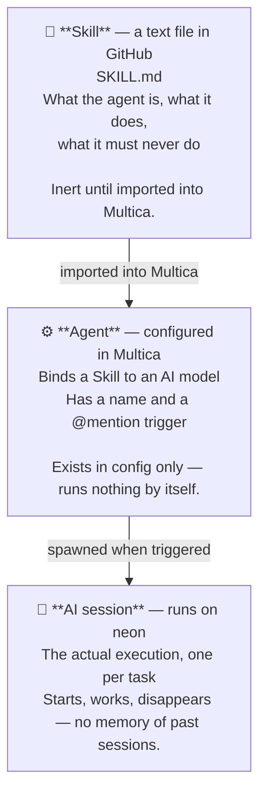
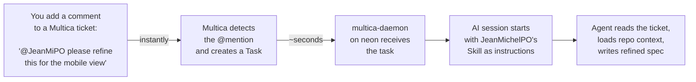

# Concepts

> *Explanation — read this before anything else.*

These terms appear throughout the documentation. Getting them right from the start avoids
confusion, especially the Skill / Agent distinction, which is the most common source of
misunderstanding.

---

## Skill vs Agent

### Skill

In AI agent systems broadly, a **Skill** is a structured description of how an agent should
behave: its role, its constraints, the process it follows, and the format of its outputs.
Think of it as a detailed job description given to the AI at the start of each session —
written as a readable, version-controlled document rather than a hidden configuration string.

**In this project**, a Skill is a Markdown file (`SKILL.md`) stored under `agents/<name>/SKILL.md`
in this repository. It defines:

- the agent's identity, role, and tone
- the hard limits it must never cross
- the step-by-step process it follows
- the expected output format
- the mapping between Multica projects and GitHub repositories

Skills are version-controlled and updated via normal git workflow. A Skill can exist in the
repository without being attached to any agent — it is just a file, inert until used.

> For how to write and deploy a Skill, see [agents/skill-authoring.md](agents/skill-authoring.md).

### Agent

In AI agent systems broadly, an **Agent** is an autonomous entity that perceives its environment,
makes decisions, and takes actions to achieve a defined goal. It has an identity (what it is),
a scope (what it can do), and a trigger that activates it.

**In this project**, an Agent is an entity configured in Multica. It ties together:

- a Skill (imported from this repository)
- a runtime (the AI engine that interprets the Skill)
- a model (which language model to use)

When a task is dispatched to an agent, the Multica daemon on the LXC spawns an AI session and
injects the Skill as the session's instructions.

**One Skill, potentially multiple agents.** The same Skill can be attached to two agents running
different models — useful for testing, cost optimisation, or speed tradeoffs.

### AI session

An **AI session** is the actual execution — the short-lived process that runs on neon when an
agent is triggered. It starts, reads its Skill and task context, performs the agent's process,
and exits. Each task gets its own isolated session; there is no memory or shared state between
sessions.

This is what you see in Multica's task history as a `Running → Completed` event. It is managed
entirely by the daemon: created, supervised, and cleaned up automatically.

### The three layers

Here is how Skill, Agent, and AI session relate to each other:



> For why the workspace mapping is embedded in each Skill rather than stored centrally,
> see [agents/skill-authoring.md](agents/skill-authoring.md#why-the-mapping-lives-in-each-skill).

---

## Workspace

In Multica, a **workspace** is the top-level organisational unit. It contains projects, agents,
and skills. Everything in this platform lives in the **Mendeleiv Lab** workspace.

Inside the workspace, tickets are organised by **project**. Each Multica project maps to one
GitHub repository:

| Multica project | GitHub repo |
|---|---|
| `neon-agents` | `Trophalaxeur/neon-agents` |
| `homelab-gallium` | `Trophalaxeur/homelab-gallium` |
| `bismuth-blog` | `Trophalaxeur/bismuth-blog` |

---

## Trigger mechanism

Agents are triggered by **`@mention`** in a Multica comment. The exact syntax is the agent's
configured mention handle (e.g., `@JeanMiPO`) written anywhere in a comment body.

### Why @mention, not assignment

Assignment changes the ticket's assignee field. It is a human workflow signal — "this ticket
is now someone's responsibility." It does **not** start an AI session.

`@mention` is explicit, traceable, and repeatable:
- You can re-trigger an agent by adding a new comment.
- You can pass inline instructions: `@JeanMiPO focus on the mobile view only`.
- Multiple agents can be mentioned in the same comment to chain actions.

> **Known limitation:** mentioning an agent via the CLI (`multica issue comment add`) does not
> always trigger a new session. Use `multica issue rerun <id>` to reliably re-dispatch.

### What it looks like in practice



The entire flow — from your comment to a refined ticket — typically takes under two minutes.

---

## Context cache

The **context cache** is a set of Markdown files, one per repository, that summarise each
repo's structure and configuration. They are stored at:

```
/home/neonuser/.neon/context/<repo-name>/context.md
```

Agents read these files at execution time to understand the codebase they are working with —
without needing live network access to GitHub or loading entire repositories into the AI context.

The cache is rebuilt nightly by `scheduler/context-nightly.sh` using
[repomix](https://github.com/yamadashy/repomix). See [context-system.md](context-system.md)
for the full explanation.

---

## The JeanMichel team

Agents in this platform are named **JeanMichel\<Role\>**. This is a deliberate convention:

- It signals that the entity is an autonomous AI agent, not a human.
- The suffix identifies the domain: `PO` for Product Owner, `Dev` for developer, etc.
- It keeps agent names distinguishable from people and generic tool names.

As new needs arise, new members join the team. See [vision.md](vision.md).
