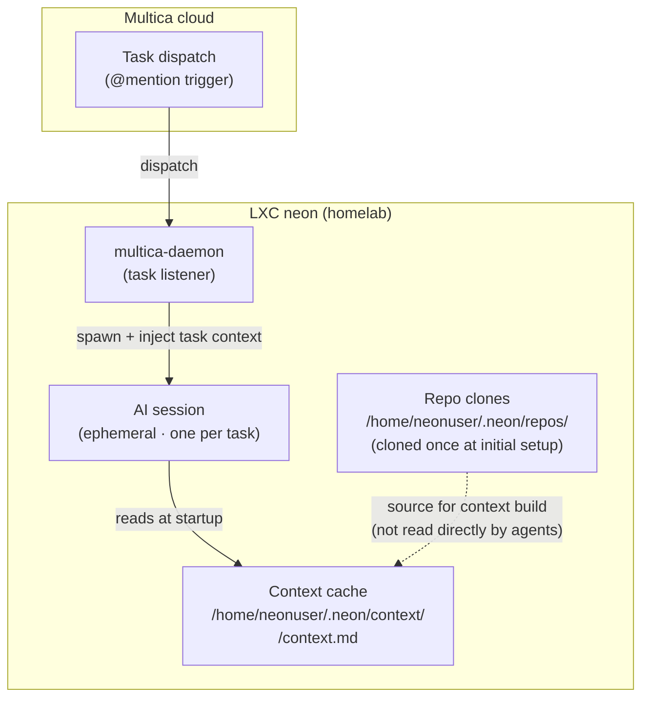
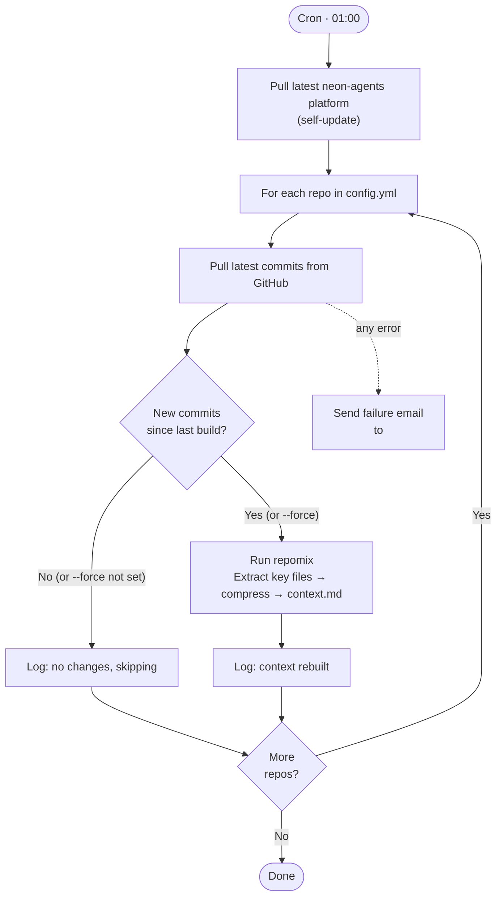
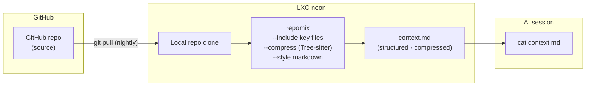

# Context system

> *Explanation — why the context cache exists and how it is built.*
>
> For the rationale behind this design choice, see [decisions.md](decisions.md#why-a-nightly-context-cache-instead-of-live-repo-access).

---

## The problem

### How the platform works without a context system

When Multica triggers an agent on LXC neon, the AI session starts with one piece of information:
the task context — the ticket's title, description, and comments. That's it.

To do anything useful (write Acceptance Criteria, assess feasibility, check existing APIs), the
agent needs to understand the codebase it is working with. Without a dedicated context system,
the two natural alternatives are:

**Option 1 — Live GitHub API access**: the agent fetches files from GitHub during the session.

| Problem | Detail |
|---|---|
| Token overhead | Every file fetch consumes tokens in the AI context window. |
| API surface | Requires a GitHub token with read access — a secret to manage, rotate, and audit. |
| Unpredictability | API latency, rate limits, and transient errors affect every execution. |
| Scope creep | A GitHub token is a foothold. Minimal access is safer. |

**Option 2 — No repo access**: the agent works from the ticket alone.

The agent invents technical facts, writes AC that reference routes or fields that don't exist,
and produces output that is immediately invalidated when a developer looks at the actual code.

### The core insight: one build per day, not one per execution

Repository structure does not change hourly. The tech stack, file layout, and configuration of
`bismuth-blog` are the same at 09:00 as at 18:00, and almost certainly the same tomorrow morning.

**Building a compact, structured representation of each repository once a night**, and making it
available as a static file, shifts the token cost from "paid on every agent execution" to
"paid once every 24 hours at most". An agent that runs 10 times a day reads the same pre-built
file — the repository is processed once, not ten times.

This is the context cache.

---

## Setup overview

Before describing the rebuild pipeline, here is where the context cache fits in the broader
system at execution time:



---

## How the context cache is built

The context builder is a bash script (`scheduler/context-nightly.sh`) scheduled as a cron job
at 01:00 on neon. It runs as `neonuser` and has no AI component — it is a deterministic
extraction and formatting pipeline.



### Key steps

**Self-update** — Before processing any repo, the script pulls the latest version of
`/opt/neon-agents`. This ensures that changes to `config.yml` or the script itself are picked
up nightly without manual intervention.

**Change detection** — The script compares two Unix timestamps:
- `LAST_CHANGE` = timestamp of the most recent commit in the repo (`git log -1 --format=%ct`)
- `LAST_BUILD` = modification time of the existing `context.md` (`stat -c %Y`)

A rebuild happens only when `LAST_CHANGE > LAST_BUILD`. Unchanged repos are skipped.

**Force rebuild** — Pass `--force` to rebuild all repos regardless of change detection:

```bash
sudo -u neonuser bash /opt/neon-agents/scheduler/context-nightly.sh --force
```

Use this after changing include globs in `config.yml`, or after a repomix upgrade.

**Error handling** — The script uses `set -e` and traps any error to send a failure email:

```bash
trap '... | mail -s "[neon] context build FAILED" "$NEON_ADMIN_EMAIL"' ERR
```

---

## repomix



[repomix](https://github.com/yamadashy/repomix) converts a local repository clone into a single
Markdown document suitable for AI consumption. It has no AI component — it is a pure extraction
and formatting tool.

### Why repomix over manual extraction

A naive `cat README.md package.json ...` produces an unstructured flat dump. repomix adds:

- **Tree-sitter compression** (`--compress`): parses code files and retains only function
  signatures, type declarations, and class structures — not full implementations. A large
  codebase that would cost tens of thousands of tokens as a raw dump can be reduced to a few
  thousand tokens while preserving everything structurally relevant.
- **Consistent structure**: `--style markdown` produces a file with one clearly labelled section
  per file, readable by both agents and humans.
- **Configurable scope**: `--include` controls exactly which files are extracted.

### Which files are extracted

Defined in `agents/context-builder/config.yml`:

```yaml
include:
  - CLAUDE.md
  - README.md
  - package.json
  - pyproject.toml
  - Makefile
  - .eslintrc*
  - .stylelintrc*
  - .prettierrc*
  - .github/workflows/*.yml
```

These globs are also replicated in `INCLUDE_GLOBS` inside `context-nightly.sh`. Both must be
kept in sync when adding new patterns.

---

## File locations reference

| Path | Description |
|---|---|
| `/opt/neon-agents/` | Platform repo (auto-updated nightly) |
| `/opt/neon-agents/agents/context-builder/config.yml` | Repo list + include globs |
| `/opt/neon-agents/scheduler/context-nightly.sh` | Nightly rebuild script |
| `/home/neonuser/.neon/repos/Trophalaxeur/<repo>/` | Local repo clones |
| `/home/neonuser/.neon/context/<repo>/context.md` | Context cache output (read by agents) |
| `/home/neonuser/.neon/logs/context-nightly-YYYYMMDD.log` | Per-run log |
