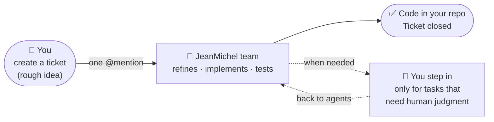

# neon-agents

> Self-hosted platform for AI agents, orchestrated by Multica.

---

## What is this?

You want something done: a new feature, a bug fix, a content change. You write a rough
description — a few words or sentences. The **JeanMichel team** handles the rest: one agent
clarifies the spec, another writes the code, another validates it.

You step in only when a task genuinely needs a human: a physical server, a personal password,
an important design decision. Everything else is automated, end to end.

The platform runs entirely on a personal homelab. No third-party cloud executes your code — all AI sessions run on your homelab.



---

## New here? Start with these

1. **[Concepts](concepts.md)** — the vocabulary, ~5 min
2. **[Architecture](architecture.md)** — how the pieces connect, ~10 min
3. **[Vision](vision.md)** — where this is going, ~5 min

Everything else (Multica, context system, operations, agents) can be read on demand.

---

## Documentation

| Document | Description |
|---|---|
| [Concepts](concepts.md) | Core vocabulary — read first |
| [Architecture](architecture.md) | How the system works today |
| [Vision](vision.md) | Multi-agent future and design intent |
| [Multica](multica.md) | Why Multica, how it works |
| [Context system](context-system.md) | How agents know about your repos |
| [Design decisions](decisions.md) | Why the platform works the way it does |
| [Ticket lifecycle](ticket-lifecycle.md) | All statuses and transitions |
| [Glossary](glossary.md) | Term definitions |
| [Operations](operations.md) | Day-to-day commands |
| [Troubleshooting](troubleshooting.md) | Diagnosing and fixing problems |
| [Agents overview](agents/index.md) | How agents work in the platform |
| [Skill authoring](agents/skill-authoring.md) | Creating a new agent skill |
| [JeanMichelPO](agents/jean-michel-po.md) | PO agent specification |

## Diagrams

Full-size D2 diagrams for use outside of GitHub (presentations, print, offline reading):

| Diagram | Description |
|---|---|
| [Workflow](diagrams/workflow.svg) | Complete system flow — ticket creation, agent execution, nightly context refresh, inter-agent handoff |
| [Architecture](diagrams/architecture.svg) | Static topology — all components, zones, and labeled connections |

Source files: [diagrams/workflow.d2](diagrams/workflow.d2) · [diagrams/architecture.d2](diagrams/architecture.d2)

---

## Deployed agents

| Agent | Nickname | Trigger | Role |
|---|---|---|---|
| JeanMichelPO | `@JeanMiPO` | Comment mention | Refines Multica tickets for execution |

## Quick links

```bash
multica daemon status                                               # daemon health
multica issue rerun <id>                                            # re-trigger an agent
multica skill update <skill-id>                                     # deploy skill changes
sudo -u neonuser bash /opt/neon-agents/scheduler/context-nightly.sh --force  # rebuild context
```
