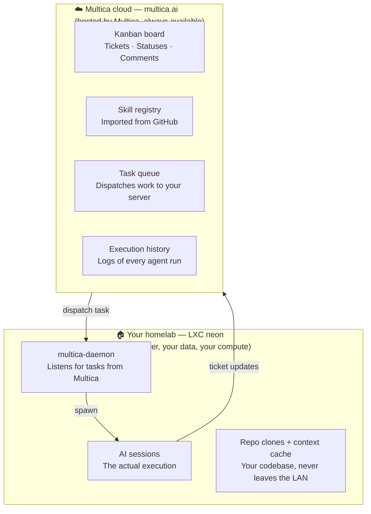

# Multica

> *Explanation — why this tool was chosen and how it works.*
>
> For operational commands (daemon status, skill update, etc.), see [operations.md](operations.md).
> For a concise index of all design decisions, see [decisions.md](decisions.md).

---

## Why Multica

The choice of Multica was not obvious. Here is the full story.

### Stage 1 — The original design: GitHub Projects + scripts

The initial design, before any code was written, used GitHub Projects v2 as the Kanban board.
The plan was:

- **GitHub Projects v2** — ticket columns (`ToRefine`, `Ready`, `In Progress`, etc.)
- **An AI runtime** — the reasoning engine, invoked per ticket
- **Bash + Python** — orchestration scripts and GitHub Projects GraphQL manipulation
- **systemd timer** — nightly scheduling

This approach was functional on paper. The bottleneck was GitHub Projects v2: managing ticket
status transitions (`ToRefine → Ready`) requires Python + GraphQL calls that are complex for
what is essentially a status field update. Worse, GitHub Projects has no concept of an agent
runtime — everything around spawning the AI, injecting context, and managing sessions had
to be built from scratch.

The core missing piece: **who spawns the AI, and how does it know what to do?**

### Stage 2 — Multica as the solution

Multica provides the missing runtime natively:

- A **daemon** that runs on the server, listens for tasks from the cloud, and spawns AI sessions
  on demand
- **Workdir injection**: each session gets a dedicated directory with a `CLAUDE.md` containing
  the full issue context (title, description, comments) and environment variables (`MULTICA_TOKEN`,
  `MULTICA_TASK_ID`, etc.)
- **Skill import**: agent instructions are imported from a GitHub URL — no separate config needed
- **Task lifecycle**: `Queued → Dispatched → Running → Completed` tracked automatically

This replaces the entire orchestration layer (Bash scripts, Python GraphQL, systemd unit for
session management) with a single daemon. The Kanban and the agent runtime live in the same tool.

### Stage 3 — Self-hosted attempt

Multica offers two deployment modes: a hosted cloud version (multica.ai) and a self-hosted
option via Docker Compose. The self-hosted path was attempted first to keep everything on
the homelab. It failed before reaching the first login:

- The Docker Compose setup requires a working **SMTP server** to send the confirmation email
  for account creation. There was no local SMTP available.
- Even with SMTP configured, the Multica UI runs on a port that is not exposed outside the LXC,
  requiring an SSH tunnel just to log in.
- The setup was non-trivial and fragile to maintain.

### Stage 4 — Multica cloud (current)

The decision: use **multica.ai** (the hosted cloud version) for the Kanban and orchestration,
keep the **daemon local** on the LXC.

This gives the best of both worlds:
- No infrastructure to maintain for the UI and task coordination
- The actual AI execution stays on the homelab (no data leaves the LAN, compute cost is zero)

Since `neon-agents` is a public repository, there is no data sovereignty concern: no secrets,
no private code, no personal data flows through Multica.

---

## How it works

### The split: cloud UI + local execution



> Multica orchestrates — but never runs your code and never sees your repositories.
> All AI execution happens on your server.

### The three interfaces

#### UI — multica.ai

The web interface at multica.ai provides:
- The Kanban board (tickets, statuses, projects)
- Skill management: import from GitHub, view/edit, update
- Agent configuration: model selection, runtime, mention handle
- Task history: execution log per ticket, stdout of each session

This is the primary interface for viewing ticket state and monitoring agent runs.

#### Daemon — `multica-daemon.service` on neon

The daemon is the bridge between the cloud and the LXC. It:

1. Maintains a persistent connection to Multica cloud
2. Receives dispatched tasks
3. Creates a workdir per task:
   ```
   ~/multica_workspaces/{workspace_id}/{task_id}/workdir/
   ```
4. Writes a `CLAUDE.md` in the workdir with the full issue context (injected by Multica)
5. Injects environment variables into the session
6. Spawns an AI session with the Skill as system prompt
7. Waits for the session to exit
8. Reports `Completed` (or `Failed`) back to the cloud

The daemon process: `/usr/local/bin/multica daemon start --foreground`
Systemd unit: `multica-daemon.service`
Listening address: `127.0.0.1:19514`

#### CLI — Thallium

The `multica` CLI installed on Thallium (operator machine) is **CLI-only** — no daemon runs
there. It is authenticated via OAuth and used for:

- Creating tickets: `multica issue create`
- Triggering agents: `multica issue rerun <id>`
- Viewing history: `multica issue runs <id>`
- Updating skills: `multica skill update <skill-id>`

### How the daemon invokes an AI session

When a task is dispatched:

**Workdir structure:**
```
~/multica_workspaces/{workspace_id}/{task_id}/workdir/
├── CLAUDE.md     ← created by the daemon with issue data received from Multica
└── (agent creates files here during execution — ephemeral)
```

**Injected environment variables:**

| Variable | Content |
|---|---|
| `MULTICA_TOKEN` | Auth token for `multica` CLI calls |
| `MULTICA_SERVER_URL` | API endpoint |
| `MULTICA_WORKSPACE_ID` | Workspace UUID |
| `MULTICA_AGENT_NAME` | Agent name as configured in Multica |
| `MULTICA_AGENT_ID` | Agent UUID |
| `MULTICA_TASK_ID` | **Task** ID (not the issue ID — read the issue ID from CLAUDE.md) |

**The `CLAUDE.md` file** is the agent's primary source of truth for the current task. It contains
the issue ID that all subsequent `multica issue *` CLI calls need.

---

## Workspace "Mendeleiv Lab"

The workspace contains one Multica project per managed GitHub repository:

| Multica project | GitHub repo | Purpose |
|---|---|---|
| `neon-agents` | `Trophalaxeur/neon-agents` | This platform |
| `homelab-gallium` | `Trophalaxeur/homelab-gallium` | Homelab infra (Terraform + Ansible) |
| `bismuth-blog` | `Trophalaxeur/bismuth-blog` | Personal blog |

Each agent's `SKILL.md` embeds this mapping so it can find the right context cache and repo
clone without any runtime configuration.

---

## Homelab integration

### Daemon on neon

The daemon runs as a persistent systemd service under `neonuser`. It was provisioned by an
Ansible role in the `homelab-gallium` repository. For day-to-day commands (status, logs,
restart), see [operations.md](operations.md).

### CLI on Thallium

The `multica` binary is installed at `/usr/local/bin/multica` (version 0.3.2 at time of writing).
Authentication is OAuth-based — run `multica auth login` to re-authenticate if the token expires.

No daemon, no open ports, no background process on Thallium.
