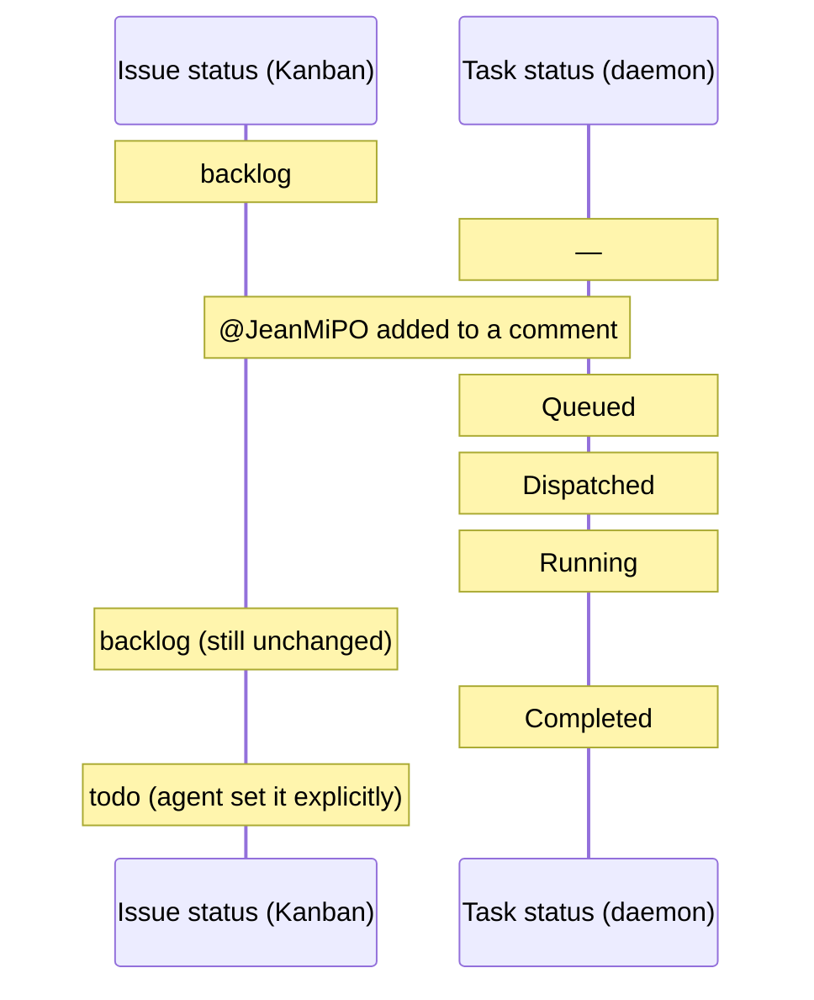
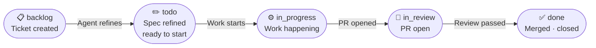
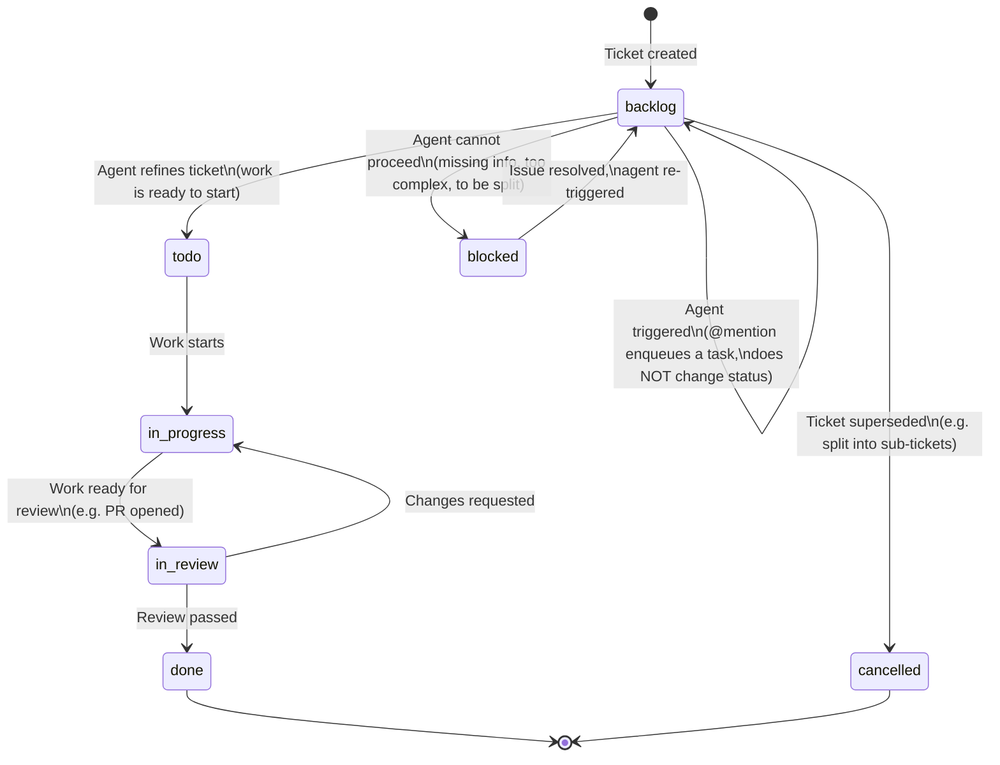

# Ticket lifecycle

> *Reference — all statuses and transitions.*
>
> For agent-specific transitions (JeanMichelPO decisions, REFINE/UNCLEAR/SPLIT), see
> [agents/jean-michel-po.md](agents/jean-michel-po.md).

---

## Two parallel lifecycles

Every ticket in Multica has **two independent state machines** running simultaneously. Confusing
them is a common source of misunderstanding when debugging a stuck pipeline.

### Issue status — visible in the Kanban

The issue status reflects **what stage the work is at**. It is changed explicitly by agents (via
`multica issue status <id> <status>`) or by humans. This is what you see on the board.

### Task status — internal to the daemon

Every time an agent is triggered, Multica creates a **task** — a single execution record. The
task has its own lifecycle, managed entirely by the daemon. It is not visible in the Kanban.

`MULTICA_TASK_ID` in the agent's environment is the task ID. The issue ID is separate, and
read from the `CLAUDE.md` file in the workdir.

### How they run in parallel

A concrete example showing what each side sees when JeanMichelPO runs on a ticket:

The issue status does not change when a task is dispatched or while the session is running.
It only changes when the agent explicitly calls `multica issue status <id> <new-status>`.
A `Running` task on a `backlog` ticket is normal — they are independent.

---

## The happy path

Before the full state machine, here is the most common flow when everything goes smoothly:

The full state machine below adds the detours: blockers, re-work loops, splits, and cancellations.

## Issue status state machine

---

## Issue status reference

| Status | Meaning | Typically set by |
|---|---|---|
| `backlog` | Created, not yet ready to act on | User (on creation) |
| `todo` | Ready to be picked up — refined or otherwise unblocked | Refinement agent or human |
| `in_progress` | Work is actively happening | Execution agent or human |
| `in_review` | A deliverable (e.g. PR) is open and awaiting review | Execution agent or human |
| `done` | Work complete, all AC verified | Review agent or human |
| `blocked` | Requires human input before work can continue | Any agent that hits a blocker |
| `cancelled` | Ticket superseded or withdrawn | Any agent or human |

---

## Task status reference

Task statuses are managed by the Multica daemon. Agents cannot set them.

| Status | Meaning |
|---|---|
| `Queued` | Task created (trigger fired), waiting for the daemon |
| `Dispatched` | Daemon received the task, workdir being prepared |
| `Running` | AI session is active |
| `Completed` | Session exited cleanly |
| `Failed` | Session exited with an error or was killed |

A task stuck in `Dispatched` usually means the daemon is unresponsive.
See [troubleshooting.md](troubleshooting.md).

---

## Actors and transitions

| Actor | Can set status to |
|---|---|
| User | `backlog` (on creation), any status manually |
| Refinement agent | `todo`, `blocked`, `cancelled` |
| Execution agent | `in_progress`, `in_review` |
| Review agent | `done`, back to `in_progress` |

No agent should set `in_review` unless it has produced a deliverable awaiting external review.
No agent should set `done` unless it has verified that all AC items are satisfied.
