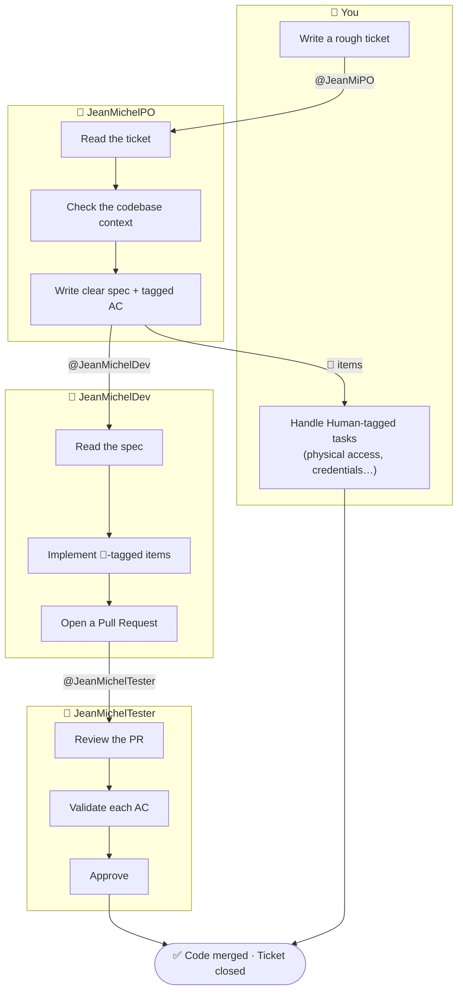
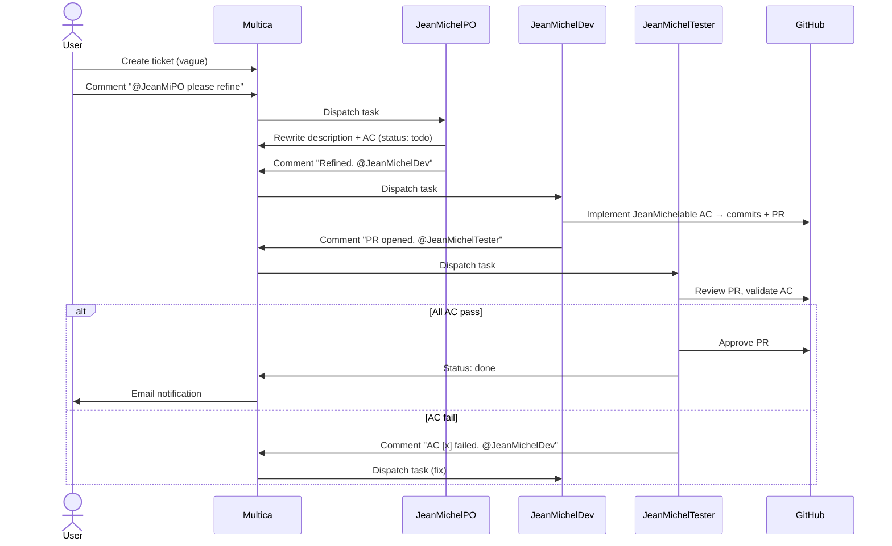

# Vision

> *Explanation — intent and future direction. This is what the system is designed to become,
> not what it is today. See [architecture.md](architecture.md) for the current state.*
>
> For the rationale behind agent decoupling and the @mention pattern, see [decisions.md](decisions.md).

---

## The goal

A user creates a vague ticket. The JeanMichel team handles the rest.

The vision is a **fire-and-forget delivery pipeline**: you describe what you want, the agents
refine, implement, test, and close the loop — pausing only at steps that genuinely require a
human (physical access, personal credentials, design decisions). Multica is the control plane
that routes work between agents and notifies when action is needed.

No agent calls another directly. No agent needs to know the others exist. The only shared
interface is the **ticket state** in Multica — status, comments, assignee.

---

## The JeanMichel team

Each agent owns exactly one stage of the delivery pipeline. They are independent, composable,
and additive — adding a new agent does not change how existing agents work.

| Agent | Role | Creates | Depends on | Status |
|---|---|---|---|---|
| **JeanMichelPO** | Refines tickets for execution | Refined description + AC | — | ✅ Deployed |
| **JeanMichelDev** | Implements `JeanMichelable` AC | Commits + PR | JeanMichelPO | 🔜 Planned |
| **JeanMichelTester** | Reviews PR, validates AC | Review comment + approval | JeanMichelDev | 🔜 Planned |
| **JeanMichelTranslator** | Translates content/i18n tasks | Updated files + PR | JeanMichelPO | 🔜 Planned |
| **JeanMichelDesigner** | Generates or adjusts UI/visual assets | Files + PR | JeanMichelPO | 🔜 Planned |

This table is intentionally incomplete — agents are created as needs arise, not upfront.
The pattern is stable; the team grows organically.

---

## Multi-agent pipeline

### At a glance

Each agent owns one lane. The baton passes via a comment mention.



### Detailed sequence

A complete ticket lifecycle through the planned pipeline:



### What the user does

- Create the ticket (a title and a rough description is enough)
- Mention `@JeanMiPO` to start the chain
- Review and approve `Human`-tagged AC items (physical access, credentials, etc.)
- Merge the PR once JeanMichelTester has approved it

Everything else is handled by the agents.

---

## Multica as the message bus

### Why agents don't call each other directly

Direct agent-to-agent calls would create hard dependencies: Agent A would need to know Agent B's
API, ID, or endpoint. This coupling makes the system brittle — changing one agent would require
updating others.

Instead, every inter-agent communication happens **via a comment on the ticket**. An agent that
wants to hand off work simply mentions the next agent in its closing comment. Multica sees the
mention and dispatches the task. The agents are fully decoupled.

This also makes the pipeline **auditable**: every handoff is a comment in the ticket history.
You can see exactly what each agent did and why, and replay from any point.

### The shared interface: ticket state

The only state shared between agents is the ticket in Multica:

- **Description** — the refined spec (written by JeanMichelPO, read by JeanMichelDev)
- **Status** — current stage (`todo`, `in_progress`, `in_review`, `done`, `blocked`)
- **Comments** — handoffs, decisions, errors, and instructions
- **Assignee** — who is responsible for the next action

Agents must treat everything they need to know as recoverable from the ticket + context cache.
No local state, no shared database, no inter-agent API.

### How an agent triggers another

A downstream trigger is just a mention in the closing comment:

```
Refined. Complexity: Medium. Executability: JeanMichelable.
👉 @JeanMichelDev
```

The mention causes Multica to enqueue a new task for JeanMichelDev. The ticket ID is the same —
the baton is passed without creating new tickets.

---

## Inter-agent scope boundaries

### AC tagging and handoff

JeanMichelPO tags every Acceptance Criteria item with its executor:

```markdown
- [ ] 🤖 [JeanMichelDev] The RSS feed endpoint returns valid XML
- [ ] 👤 [Human] The production cron job is enabled on the server
```

When JeanMichelDev receives the ticket, it only implements AC items tagged with its own name.
Human-tagged items are explicitly out of scope. This prevents agents from overstepping and
makes the division of labour unambiguous.

### How a `Human` item halts the chain

If all remaining AC items are tagged `👤 [Human]`, the automated pipeline pauses. The ticket
is assigned back to the human, who handles those items manually and then re-triggers the next
agent to verify and close.

This is by design: the system knows its limits. A `Human` tag is not a failure — it is an
explicit contract that some work requires judgment, physical presence, or credentials that no
agent should ever hold.
